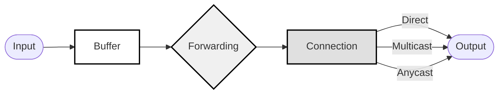

# Secure Low-Latency Interactive Messaging (SLIM)

Interconnecting these systems at scale requires meeting strict latency and response time requirements. Secure Low-Latency Interactive Messaging (SLIM) aims to provide a secure, scalable, and user-friendly communication framework that unifies state-of-the-art capabilities from all mentioned frameworks into a single implementation.

The main components of SLIM are:

- [Security layer](../messaging/slim-security-layer.md)
- [Data plane](../messaging/slim-data-plane.md)
- [Session layer](../messaging/slim-session-layer.md)
- [Control plane](../messaging/slim-control-plane.md)

## Security Layer

The Security Layer implements secure group communications using the Message Layer Security (MLS) protocol. This layer ensures end-to-end encryption, authentication, and access control across agent groups within the SLIM ecosystem.

The security layer leverages MLS to provide:

- Quantum-safe end-to-end encryption (QSE2EE) for group communications
- Dynamic group membership management
- Forward secrecy and post-compromise security
- Scalable key management for large agent groups

### Key Components

Group State Management

- Maintains cryptographic group state
- Handles member additions and removals
- Manages group epoch changes
- Processes key updates

Key Schedule

- Derives encryption keys from group secrets
- Implements MLS key schedule
- Manages key rotations
- Ensures forward secrecy

Message Protection

- Encrypts group messages
- Provides integrity protection
- Implements sender authentication
- Handles message sequencing

Authentication

- Validates group members
- Verifies message signatures
- Manages identity credentials
- Implements access control

### Security Properties

- **Forward Secrecy**: Ensures past communications remain secure if keys are compromised
- **Post-Compromise Security**: Provides security guarantees after member compromise
- **Group Authentication**: Verifies message origin within the group
- **Message Confidentiality**: Protects message content from unauthorized access

### Integration

The security layer integrates with:

- Transport layer for secure message delivery
- Session layer for maintaining secure contexts
- Identity services for credential management


## Data Plane

The Secure Low-Latency Interactive Messaging (SLIM) data plane implements an efficient message routing and delivery system between agents.

### Message Format

SLIM messages use a channel-based addressing scheme for content routing:

```protobuf
message SLIMMessage {
    string channel_id = 1;
    string message_id = 2;
    bytes payload = 3;
    MessageMetadata metadata = 4;
}
```

### Connection Table

The connection table maintains agent connectivity information by mapping channel IDs to connected agents and tracking connection state and capabilities.

### Forwarding Table

The forwarding table implements intelligent message routing by implementing the following:

- Maps message patterns to delivery strategies.
- Supports content-based routing.
- Maintains routing metrics and preferences.
- Handles multicast and anycast delivery.

### Message Buffer

The message buffer provides temporary storage by implementing the following:

- Caches messages for reliable delivery.
- Implements store-and-forward when needed.
- Supports message deduplication.
- Handles out-of-order delivery.

### Data Plane Flow



The diagram shows the message flow through the SLIM data plane components:

1. Messages enter the system and are processed by the Message Buffer.
2. The Message Buffer handles deduplication and store-and-forward.
3. The Forwarding Table determines routing strategy.
4. The Connection Table manages delivery to connected agents.
5. Messages are delivered through direct, multicast, or anycast methods.

## Session Layer

The Secure Low-Latency Interactive Messaging (SLIM) Session Layer manages and maintains the communication state between agents and their respective SLIM nodes. It provides essential services for establishing, maintaining, and terminating sessions between communicating entities in the SLIM ecosystem.

### Flow Diagram


### Key Features

- **Session Establishment**: Handles the initial handshake and connection setup.
- **State Management**: Maintains session context and state information.
- **Security**: Implements session-level security measures and token management.
- **Error Recovery**: Provides mechanisms for handling session interruptions and failures.
- **Session Termination**: Manages graceful session closure and cleanup.

### Architecture

The session layer operates between the transport and presentation layers, providing a reliable communication framework for higher-level protocol operations. It ensures the following:

* Secure session initialization.
* Stateful communication.
* Error handling and recovery.
* Graceful session termination.

## Control Plane

The Control Plane is a cloud-based controller that manages and orchestrates the configuration of SLIM nodes networks. It enables administrators to define, control, and interconnect limited domain networks while facilitating peering relationships with external networks.

### Architecture


### Key Components

Central Controller

- Provides centralized management interface
- Handles network-wide configuration
- Monitors SLIM nodes health and status
- Implements control policies

Policy Manager

- Defines access control policies
- Manages traffic routing rules
- Sets security parameters
- Controls resource allocation

Topology Manager

- Maintains network topology
- Handles SLIM nodes discovery
- Manages SLIM nodes connections
- Optimizes routing paths

Peering Registry

- Manages peering relationships
- Handles cross-network authentication
- Controls inter-network routing
- Maintains peering agreements

### Features

1. **Network Configuration**
   - SLIM nodes deployment and configuration
   - Network topology management
   - Policy distribution
   - Resource allocation

2. **Network Peering**
   - Automated peering negotiation
   - Cross-network routing
   - Federation management
   - Trust establishment

3. **Monitoring and Analytics**
   - Network health monitoring
   - Performance metrics
   - Usage analytics
   - Anomaly detection

4. **Security Management**
   - Access control
   - Network segmentation
   - Encryption requirements
   - Security policy enforcement

### Integration

The control plane integrates with:

- SLIM node management interfaces
- Security services
- Monitoring systems
- External network controllers

### Deployment

The control plane can be deployed as:

- Managed cloud service
- Private cloud installation
- Hybrid deployment