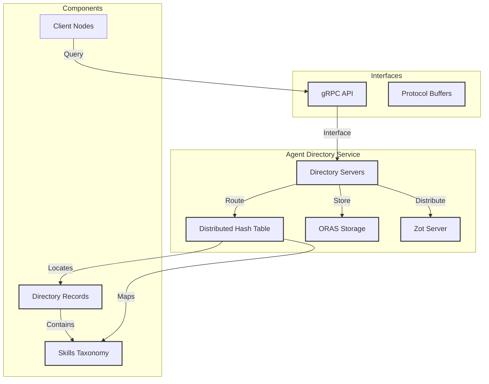

# Agent Directory Architecture

ADS (Agent Directory Service) is a distributed directory service designed to
store metadata for AI agent applications. This metadata, stored as directory
records, enables the discovery of agent applications with specific skills for
solving various problems.

The implementation features distributed directories that interconnect through a
content-routing protocol. This protocol maps agent skills to directory record
identifiers and maintains a list of directory servers currently hosting those
records.

Each directory record must include skills from a defined taxonomy, as specified
in the [Taxonomy of AI Agent Skills](taxonomy.md) from [OASF](oasf.md).

Directory records are identified by globally unique names that are routable
within a DHT (Distributed Hash Table) to locate peer directory servers.
Similarly, the skill taxonomy is routable in the DHT to map skillsets to records
that announce those skills.

While all record data is modeled using [OASF](oasf.md), only skills are
leveraged for content routing in the distributed network of directory servers.

The ADS specification is under active development and is published as an
Internet Draft at [ADS Spec](https://spec.dir.agntcy.org). The source code is
available in the [ADS Spec sources](https://github.com/agntcy).

The current reference implementation, written in Go, provides server and client
nodes with gRPC and protocol buffer interfaces. The directory record storage is
built on [ORAS](https://oras.land) (OCI Registry As Storage), while data
distribution uses the [zot](https://zotregistry.dev) OCI server implementation.

