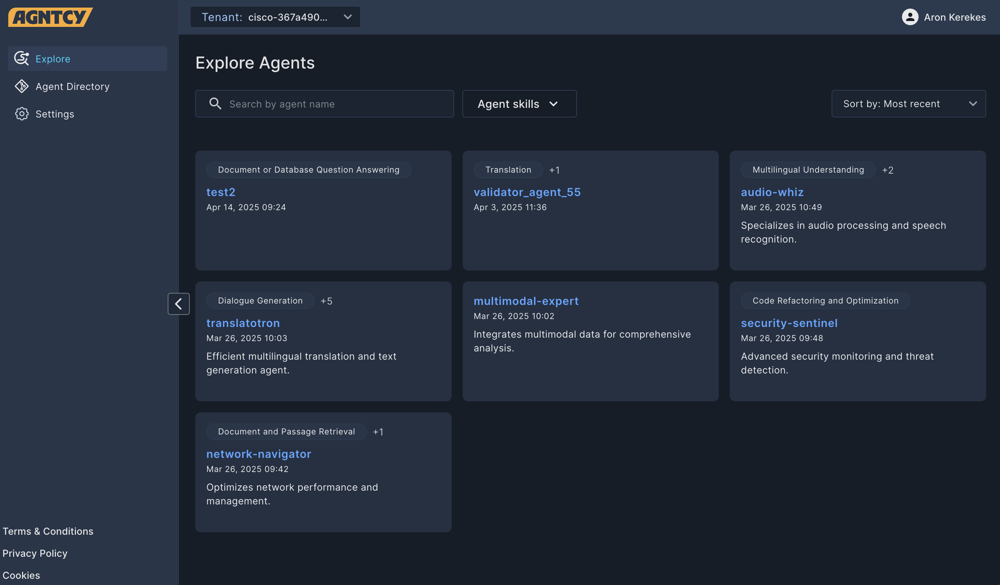
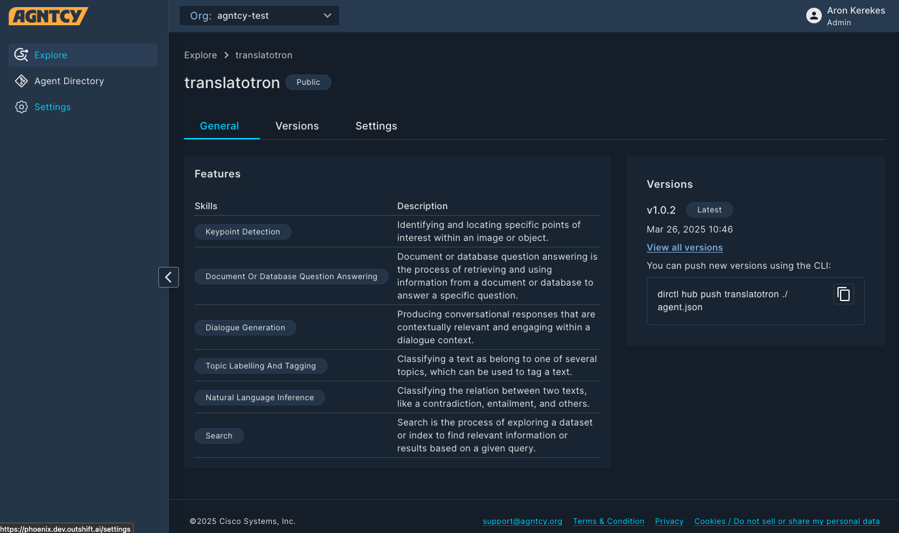

# Online Instance 

A public instance of agent directory is available at https://hub.agntcty.org. In
this section we describe the main features of this instance which is provided AS
IS to the community as a non production environment to familiarize with agent
directory. In this section we will use the name hub to indicate
hub.agntcy.org.

Hub is designed to provide a robust multi-organization platform for hosting and
managing agent repositories. Its primary aim is to deliver a hub-like user
experience, offering easy navigation and management for users. Hub
acts as a centralized point for organizing and accessing agent repositories.
This service is enhanced by a gRPC API that supports efficient service
communication and integration, ensuring seamless interaction between components.

Hub serves as the central platform for hosting and managing various
agent-related services. The main purpose is to provide a comprehensive solution
for developers and IT admins to register, discover, and manage agents in an
organized manner. By offering a secure environment for authentication and user
management, it ensures that organizations can confidently manage their agent
directories and related services.

## Features

Hub enables users to:

* View and search for public agent repositories.
* Create repositories.
* Publish records.
* Access multiple separate organizations.

## Using the Hub

### Signing up for the Hub and Logging in

To get started with the hub, sign up for free at the [AGNCTY Agent Directory
homepage](https://hub.agntcy.org/). You can sign up with your GitHub account or
by providing an email and password. Once your account is created, simply log in.
When first logging in, you are prompted to create a name for your default
organization. This organization is a personal space where all repositories
belong to you.


### Explore Page

"The Explore page allows users to browse and search through available agent repositories.



You can refine the results using predefined filters and open search:

* Use the **Search** bar to search for a text string in a repository name. To
clear the search bar, click the **×**.
* Use the drop-down **Filters** list to narrow the results by Agent Skill.
* Use the drop-down **Sort by** list to sort the displayed items by Most Recent
or Oldest.

You can change organizations by clicking the Org drop-down list and selecting
another organization.

### Agent Details

Clicking on an agent repository opens the Agent Details page with further
information on the agent repository.



The **General** tab lists the following information:

* A description of the agent.
* The creator of the agent.
* The skills associated with the agent.
* The version number and date of publishing.
* The CLI command to pull the agent's directory.

The **Versions** tab lists the published versions of the agent.

The **Settings** tab allows the owner to change the description and the
visibility of the agent.

### Agent Directory Page

The Agent Directory Page allows you to view, edit, and create agent repositories
in the Hub. Here the records are displayed in a table with customizable columns.

You can select which columns are displayed, and in which order, by clicking the
**Arrange Columns** button (***▥***).

You can reload the listed items by clicking the **Reload** button (**⟳**).

You can refine the results using predefined filters and open search:

* Use the **Search** bar to search for a text string in an agent repository
name. To clear the search, click the **×**.
* Use the drop-down **Filters** list to narrow the results by Agent Skill.
* Use the drop-down **Sort by** list to sort the displayed items by Most Recent
or Oldest.


#### Agent Actions

Clicking the three dots (**⁝**) at the end of any record in the Agent Directory
table opens a drop-down list of actions you can perform on that agent
repository.

* Click **Open Details** to view the agent.
* Click **Edit** to edit the agent.
* Click **Delete** to delete the agent.

#### Create

To list an agent in the Hub:

1. Click the **+ New Repository** button.
1. Enter the repository name and description.
1. Select the visibility for your agent repository.
    * Public agent repositories appear in search results.
    * Private agent repositories are only visible in your organization.
1. Click **Publish**.
1. You can also publish the agent repository using the generated CLI command.
1. Click **Finish**.

Your agent repository is created in the Hub.

### Settings

The settings page allows you to manage your organizations and users.

#### Organizations

Organizations represent separate spaces or organizations within the Hub,
each with its own repositories and users. The organizations available to you are
listed under the **Organizations** tab.

Clicking the three dots (**⁝**) at the end of any record in opens a drop-down
list of actions you can perform on that organization.

* Click **Edit** to edit the organization.
* Click **Delete** to delete the organization.
* Click **Switch** to switch to the organization.

You can reload the listed items by clicking the **Reload** button (**⟳**).

#### Users

The users in a organization are listed under the **Users** tab.

You can invite other users to the organization by clicking the **+ Invite User**
button.

> Note: You cannot invite other users to your personal organization created
> during signing up. To collaborate with others, create a new organization.

Clicking the three dots (**⁝**) at the end of any record in opens a drop-down
list of actions you can perform on that organization.

* Click **Edit** to edit the user's role.
* Click **Delete** to delete the user.

You can reload the listed items by clicking the **Reload** button (**⟳**).

### Using the Hub through CLI

You can use the  Hub through the CLI.

Use the `dirctl hub` command to list the available commands.

#### Initialize the Repository

In order to start with the process, an `agent.json` object needs to be created.
This can be done by initializing local code repo using:

```bash dirctl init repo ```

#### Logging in

Use the `dirctl hub login` command to log in. The login page opens in your
browser. Use your credentials to log in.

#### Listing Organizations

Use the `dirctl hub orgs` command to list the organizations you are a member of.

#### Signing Agent Data Models

You must sign the agent data models before pushing to Hub. Unsigned models are
rejected by the API. 

To sign an agent data model using identity-based OIDC signing, run `dirctl sign
./agent.json`.

#### Pushing and Pulling Agent Data Models

To pull the data model, use the `dirctl hub pull <repository>:<version>`
command. Alternatively, you can use `dirctl hub pull <digest>` instead.

To push the data model, use the `dirctl hub push <agent> ./agent.json` command.

#### Verifying Agent Data Model Signature

The verification process allows validation of the agent data model signature
against a specific identity.

To verify that an agent data model is properly signed, you can run `dirctl
verify ./agent.json`.

To verify the signature against a specific identity, for example to check if an
agent model originates from GitHub Agntcy users, run:

```bash
dirctl verify ./agent.json \ 
                 --oidc-issuer "(.*)github.com(.*)" \
                 --oidc-identity "(.*)@agntcy.com"
