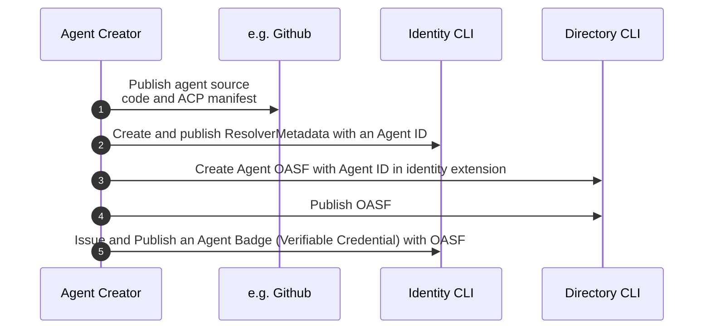
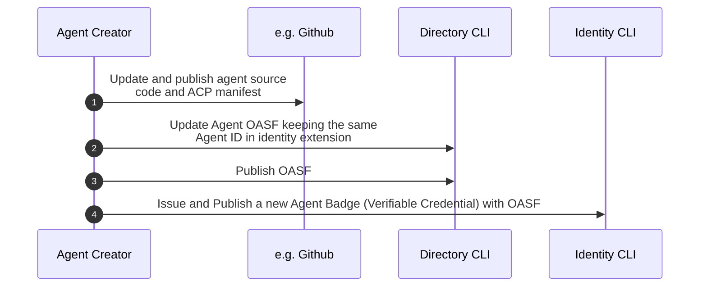
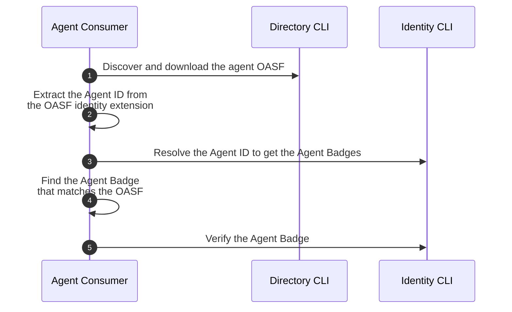
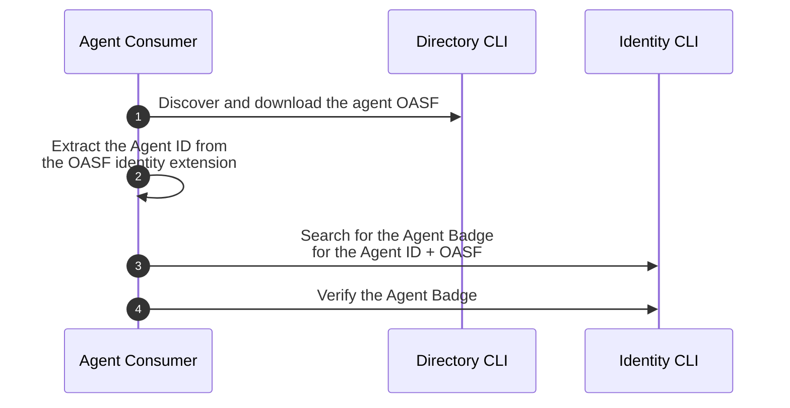

# Introduction

Ensuring secure and dependable communication between software agents is vital for building a trustworthy Internet of Agents (IoA). Much like humans use official documents, such as driver licenses to authenticate themselves in real-world interactions, software agents require reliable and verifiable credentials to confirm their identity and build trust with other agents and humans. Without effective authentication, unverified or malicious agents could disrupt any Multi-Agent System (MAS) or network of agents, potentially causing misinformation, fraud, or security vulnerabilities. Thus, a consistent and standardized approach for authenticating agents and validating their metadata is critical for fostering secure and reliable interactions across an IoA. These authentication and validation requirements also apply to Model Context Protocol (MCP) Servers and MAS, since these are positioned as building blocks, and aggregation elements, in an IoA, respectively.

## Identity Requirements

The [`AGNTCY`](https://agntcy.org/) enables the assignment of identities to Agents, MCP Servers, and MAS in a way that is:

- **Open:** No central authority is in charge of assigning IDs.
- **Collision-free:** Each Agent, MCP Server, and MAS has a universally unique identifier.
- **Verifiable:** Each Agent, MCP Server, and MAS is associated to a Verifiable Credential (VC) that can be used to authenticate its ID and provenance.

## Supporting both Conventions and Standards for ID assignment

The [`AGNTCY`](https://agntcy.org/) prescribes neither the use of a specific identity assignment technique nor the use of a specific identity format. Instead, the [`AGNTCY`](https://agntcy.org/) enables the use and amalgamation of various (heterogeneous) identity types, while ensuring a common or standard way to:

- Present identifiers
- Verify identifiers

irrespective of their identity type. To this end, the [`AGNTCY`](https://agntcy.org/) supports the use of conventions as well as the use of standards to openly assign an identity to an Agent, an MCP Server, or a MAS.

### Conventions

As a starting point, the [`AGNTCY`](https://agntcy.org/) supports two types of conventions for identity assignment:

1. The use of `User Accounts` and/or `Service Accounts` provided by an Identity Provider (IdP). Identities provided through Okta, Microsoft AD, Entra ID, Duo, Ping Identity, Auth0, or Google ID can be used in the context of [`AGNTCY`](https://agntcy.org/) to assign universally unique identifiers to Agents, MCP Servers, and MASs in a open way.

2. The use of `well-known identifiers`, e.g., following the convention proposed by Google's Agent2Agent (A2A) protocol. This convention enables both open identity assignment as well as the use of universally unique identifiers for Agent Cards, which capture the metadata and characteristics that define, allow to discover, and identify an Agent within the A2A ecosystem. More specifically, in the A2A protocol, the Agent Card standardizes the format of the data shared during discovery, which may be facilitated by hosting the Agent Card at a well-known path or identifier, such as: https://YOUR-DOMAIN/.well-known/agent.json. In this case, the Agent Card includes details such as the Agent's capabilities, authentication requirements, and endpoint information.

### Standards

Similarly, as a starting point, the [`AGNTCY`](https://agntcy.org/) supports one standard for identity assignment:

1. The use of W3C [`Decentralized Identifiers (DIDs)`](https://www.w3.org/TR/did-1.1/). The W3C standards have done ground work in the context of decentralized identifiers, decentralized credential management, and the capacity to generate, authenticate, and selectively disclose [`Verifiable Credentials (VCs)`](https://www.w3.org/TR/vc-data-model-2.0/). This approach allows organizations to assign universally unique identifiers to their Agents, MCP Servers, and MASs in a open and decentralized manner. Moreover, the identities can be stored in decentralized networks along with a set of associated VCs, which can be utilized to cryptographically verify the provenance of the Agents, MCP Servers, and MASs, their versions, their skills and other attributes and features, thereby facilitating secure multi-factor authentication (MFA) and authorization processes across these entities as well as between them and humans.

<br />

```{IMPORTANT}
Independently of whether the identity is assigned following a convention or a standardized framework, at this stage the main focus of the [`AGNTCY`](https://agntcy.org/) is to provide a common and trustworthy mechanism to **present identifiers** and to **verify them**. More specifically, the [`AGNTCY`](https://agntcy.org/) not only supports various (and heterogeneous) identifiers that are universally unique but also proposes a standard way of presenting and verifying such identifiers, thereby enabling freedom in the selection of interoperable identities in an IoA.
```

## Identity for Agents

```{image} ../../_static/agent_badge.png
:alt: Agent Badge Example
:width: 100%
:align: center
```

The figure above depicts the main elements of an Agent's subject identifier:

- Each Agent subject has a universally unique identifier named [`ID`](#identifiers).
- Each `ID` is associated 1:1 to a [`ResolverMetadata`](#identifiers) object, enabling automated resolution and trustworthy verification of Agent IDs.
- Each `ID` is also associated 1:n to an [`Agent Badge`](#verifiable-credentials).

Hence, in the [`AGNTCY`](https://agntcy.org/), an Agent subject is tied to a unique identifier linked to one or more `Verifiable Credentials (VCs)`, which contain information about the Agent, such as its ID, a schema definition (e.g., an OASF schema), and other metadata used for defining locators, authentication, MFA, etc. Agents can use this Badge for secure presentation, verification, and enabling trusted communications across multi-agent systems.

Note that the same approach applies to MCP Servers and MASs, giving rise to ResolverMetadata and Badges also for MCP Servers and MASs.

# Identifiers

## Definitions

The [`AGNTCY`](https://agntcy.org/) supports various types of identities, referred to as IDs, which serve as universally unique identifiers for the main entities or subjects operated by the [`AGNTCY`](https://agntcy.org/), including Agents and Multi-Agent Systems (MAS).

### Key Identifiers

Each ID is associated 1:1 with ResolverMetadata, which contains the necessary information to establish trust while trying to use or interact with an Agent or a MAS ID.
ID: A universally unique identifier that represents the identity of a subject (e.g., an Agent or MAS).
ResolverMetadata: Metadata, represented in the form of a JSON-LD object, containing cryptographic material and verification methods to resolve and establish trust with the associated ID (e.g., an Agent or MAS).

Concrete examples with various IDs and associated ResolverMetadata can be found [`here`](https://spec.identity.agntcy.org/docs/id/examples)

# Verifiable Credentials

## Definitions

The [`AGNTCY`](https://agntcy.org/) supports various types of verifiable credentials, referred to as VCs. A verifiable credential is a specific way to express and present a set of claims made by an issuer, such as an agent definition (e.g., an [`OASF Definition`](https://schema.oasf.agntcy.org/objects/agent), or an [`A2A Agent Card`](https://github.com/google/A2A/blob/main/specification/json/a2a.json#AgentCard)), a deployment configuration, or an authorization claim that could be used during a MFA process.

### Key Verifiable Credentials (VCs)

One of the key `VCs` within the [`AGNTCY`](https://agntcy.org/) is the following:

- `Agent Badge`: An enveloped `VC`, captured in the form of a JSON-LD object, that represents a specific definition of an Agent subject in the IoA. The definition follows a given schema (e.g., an OASF definition or an A2A Agent Card schema). An Agent subject could have multiple Agent Badges, each representing a different definition of the same core Agent or Agent subject. For instance, different software versions and/or patched releases of an Agent will have different Agent Badges. The same applies if the Agent's code is available in different forms (e.g, if it can be used and composed using different types of artifacts, such as a Docker container image or a python package), or if the source code can be reached at different sites or routing locators (e.g., through github or sites like hugging face), etc. Concrete examples of an Agent Badge can be found [`here`](https://spec.identity.agntcy.org/docs/vc/agent-badge).

<!---
- `Agent Passport`: An enveloped `VC`, captured in the form of a JSON-LD object, that represents an Agent subject in the IoA. While an Agent subject could have "n" different Agent Badges or definitions, it will be associated to one "Agent Passport", which in turn will be associated to single Agent `ID`. Hence, there is:

  - An n:1 relationship between Agent Badges and an Agent Passport
  - A 1:1 relationship between an Agent Passport and an Agent `ID`
  - A common element that binds Agent Badges and an Agent Passport, which is the same Agent `ID`.

More specifically, the role of the "Agent Passport" is to cryptographically bind an Agent ID to an ISSUER, a public key and a proof of provenance, while the role of the Agent Badges is to enable the binding of the same Agent `ID` to different definitions of the core Agent, including different schemas, versions, locators, etc., as well as to additional `VCs` that may be used during Multi-Factor AuthN/AuthZ (MFA) processes. A concrete example of an Agent Passport can be found [`here`](../vc/agent-passport.md).

-->

The identity framework conceived by the `AGNTCY` allows not only to cryptographically bind an Agent ID to an ISSUER, a public key and a proof of provenance but also to enable the binding of the same Agent `ID` to different definitions of the core Agent, including different schemas, versions, locators, etc., as well as to additional `VCs` that may be used during Multi-Factor AuthN/AuthZ (MFA) processes.

<br />

```{IMPORTANT}
As detailed in the [`Agent Badge Examples`](https://spec.identity.agntcy.org/docs/vc/agent-badge), the combined use of an `Agent Badge` with `ResolverMetadata` objects enables the automatic and trustworthy discovery not only of the PubKey associated to the Agent issuer but also of the verification material to prove the authenticity and integrity of the Agent Badge, according to the assertionMethod defined in the `ResolverMetadata` object.

Furthermore, the use of Agent Badges provides a set of key properties in an IoA:

1. It addresses the problem of **Agent impersonation**, by avoiding scenarios where one organization could offer rogue Agents as if they were created by another (trusted) company.
2. It enables **trustworthy origination, traceability, and lineage of Agents**. Note that Agents will end up having different versions and releases (e.g., due to security patches and updates), so while a company might be using version 2.08 of Agent `ID` = X, another company might be using version 2.1 of Agent Agent `ID` = X. Knowing that there is a key vulnerability and recommended upgrade for Agent `ID` = X, version 2.08, would allow the first company to migrate to version 2.1, while inform the second company that the upgrade is not needed.
3. It **enables more sophisticated AuthN and AuthZ processes among agents with and without a human in the loop**, including the **capacity to build trust even before an Agent is selected and used**. In subsequent updates to this documentation, the [`AGNTCY`](https://agntcy.org/) will provide examples involving MFA and how to build trust dynamically among Agents.
```

# Flow Diagrams

## Agntcy - User Flows

### Create a New Agent

This sequence diagram illustrates the process of creating, publishing, and registering an Agent's metadata and identity information within the Agntcy ecosystem.



### Update an Agent

This sequence diagram illustrates the process of updating an existing Agent along with its associated metadata and identity information within the Agntcy ecosystem.



### Verify an Agent Locally

This sequence diagram illustrates the local verification process of an Agent's authenticity, including its associated identity credentials, within the Agntcy ecosystem.



### Verify an Agent Using Search Endpoint

This sequence diagram illustrates the process of verifying an Agent's authenticity using a search endpoint within the Agntcy ecosystem. This approach allows the Agent Verifier to locate and validate the correct Agent Badge by querying directly with both the Agent ID and OASF.



Additional flow diagrams can be found in the [`Identity Spec`](https://spec.identity.agntcy.org/docs/category/sequence-flows).

# Quick Start Guide

## Get Started

This short guide allows you to setup the Identity `Issuer CLI` as well as the Identity `Node Backend`.
The `Issuer CLI` allows to generate, register, search for, and verify badges for Agents and MCP Servers. The CLI includes a library enabling storage and retrieval of the keys required to sign the badges, both on local storage or using a 3rd party wallet or vault.
The `Node Backend` comprises the APIs and the backend core. It stores, maintains, and binds org:sub-org IDs, PubKeys, Subject IDs and metadata, including badges, ResolverMetadata and Verifiable Credentials (VCs).

### Prerequisites

To run these steps successfully, you need to have the following installed:

- [Docker Desktop](https://docs.docker.com/get-docker/), or have both: [Docker Engine v27 or higher](https://docs.docker.com/engine/install/) and [Docker Compose v2.35 or higher](https://docs.docker.com/compose/install/)

### Step 1: Install the Issuer CLI

Use the following command to install the `Issuer CLI`:

using `curl`:

```bash
sh -c "$(curl -sSL https://raw.githubusercontent.com/agntcy/identity/refs/heads/main/deployments/scripts/identity/install_issuer.sh)"
```

or using `wget`:

```bash
sh -c "$(wget -qO- https://raw.githubusercontent.com/agntcy/identity/refs/heads/main/deployments/scripts/identity/install_issuer.sh)"
```

```{NOTE}
> You can also download the `Issuer CLI` binary corresponding to your platform from the [latest releases](https://github.com/agntcy/identity/releases).
>
> On some platforms you might need to add execution permissions and/or approve the binary in `System Security Settings`.
>
> For easier use, consider moving the binary to your `$PATH` or to the `/usr/local/bin` folder.
```

If you have `Golang` set up locally, you could also use the `go install command`:

```bash
go install github.com/agntcy/identity/cmd/issuer@latest && \
  ln -s $(go env GOPATH)/bin/issuer $(go env GOPATH)/bin/identity
```

### Step 2: Start the Node Backend with Docker

1. Clone the repository:

   ```bash
   git clone https://github.com/agntcy/identity.git
   ```

2. Start the Node Backend with Docker:

   ```bash
   ./deployments/scripts/identity/launch_node.sh
   ```

   Or use `make` if available locally:

   ```bash
   make start_node
   ```

### Step 3: Verify the Installation

You can verify the installation by running the command below to see the [different commands available](#core-commands-to-use-the-cli):

```bash
identity -h
```

## Core commands to use the CLI

Here are the core commands you can use with the CLI

- **vault**: Manage cryptographic vaults and keys
- **issuer**: Register and manage issuer configurations
- **metadata**: Generate and manage metadata for identities
- **badge**: Issue and publish badges for identities
- **verify**: Verify identity badges
- **config**: Display the current configuration context

## Run the demo

This demo scenario will allow you to see how to use the AGNTCY Identity components can be used in a real environment.
You will be able to perform the following:

- Register as an Issuer
- Generate metadata for an MCP Server
- Issue and publish a badge for the MCP Server
- Verify the published badge

### Prerequisites

First, follow the steps in the [Get Started](#get-started) section above to install the `Issuer CLI` and run the `Node Backend`, and generate a local vault and keys.

To run this demo setup locally, you need to have the following installed:

- [Docker Desktop](https://docs.docker.com/get-docker/), or have both: [Docker Engine v27 or higher](https://docs.docker.com/engine/install/) and [Docker Compose v2.35 or higher](https://docs.docker.com/compose/install/)
- [Ollama CLI](https://ollama.com/download)
- [Okta CLI](https://cli.okta.com/manual/#installation)

### Step 1: Run the Samples with Ollama and Docker

The agents in the samples rely on a local instance of the Llama 3.2 LLM to power the agent's capabilities.
With Ollama installed, you can download and run the model (which is approximately 2GB, so ensure you have enough disk space) using the following command:

1. Run the Llama 3.2 model:

   ```bash
   ollama run llama3.2
   ```

2. From the root of the repository, navigate to the `samples` directory and run the following command to deploy the `Currency Exchange A2A Agent` leveraging the `Currency Exchange MCP Server`:

   ```bash
   cd samples && docker compose up -d
   ```

3. [Optional] Test the samples using the provided [test clients](https://github.com/agntcy/identity/tree/main/samples/README.md#testing-the-samples).

### Step 2: Use the CLI to create a local Vault and generate keys

1. Create a local vault to store generated cryptographic keys:

   ```bash
   identity vault connect file -f ~/.identity/vault.json -v "My Vault"
   ```

2. Generate a new key pair and store it in the vault:

   ```bash
   identity vault key generate
   ```

### Step 3: Register as an Issuer

For this demo we will use Okta as an IdP to create an application for the Issuer.
The quickly create a trial account and application, we have provided a script to automate the process using the Okta CLI.

```{IMPORTANT}
> If you already have an Okta account, you can use the `okta login` command to log in to your existing organization.
>
> If registering a new Okta developer account fails, proceed with manual trial signup and then use the `okta login` command,
> as instructed by the Okta CLI.
```

1. Run the following command from the root repository to create a new Okta application:

   ```bash
   . ./demo/scripts/create_okta_app
   ```

2. In the interactive prompt, choose the following options:

   `> 4: Service (Machine-to-Machine)`, `> 5: Other`

3. Register the Issuer using the `Issuer CLI` and the environment variables from the previous step:

   ```bash
   identity issuer register -o "My Organization" \
       -c "$OKTA_OAUTH2_CLIENT_ID" -s "$OKTA_OAUTH2_CLIENT_SECRET" -u "$OKTA_OAUTH2_ISSUER"
   ```

```{NOTE}
> You can now access the `Issuer's Well-Known Public Key` at [`http://localhost:4000/v1alpha1/issuer/{common_name}/.well-known/jwks.json`](http://localhost:4000/v1alpha1/issuer/{common_name}/.well-known/jwks.json),
> where `{common_name}` is the common name you provided during registration.
```

### Step 4: Generate metadata for an MCP Server

Create a second application for the MCP Server metadata using Okta, similar to the previous step:

1. Run the following command from the root repository to create a new Okta application:

   ```bash
   . ./demo/scripts/create_okta_app
   ```

2. In the interactive prompt, choose the following options:

   `> 4: Service (Machine-to-Machine)`, `> 5: Other`

3. Generate metadata for the MCP Server using the `Issuer CLI` and the environment variables from the previous step:

   ```bash
   identity metadata generate -c "$OKTA_OAUTH2_CLIENT_ID" \
       -s "$OKTA_OAUTH2_CLIENT_SECRET" -u "$OKTA_OAUTH2_ISSUER"
   ```

> [!NOTE]
> When successful, this command will print the metadata ID, which you will need in the next step to view published badges that are linked to this metadata.

### Step 5: Issue and Publish a Badge for the MCP Server

1. Issue a badge for the MCP Server:

   ```bash
   identity badge issue mcp -u http://localhost:9090 -n "My MCP Server"
   ```

2. Publish the badge:

   ```bash
   identity badge publish
   ```

```{NOTE}
> You can now access the `VCs as a Well-Known` at [`http://localhost:4000/v1alpha1/vc/{metadata_id}/.well-known/vcs.json`](http://localhost:4000/v1alpha1/vc/{client_id}/.well-known/vcs.json),
> where `{metadata_id}` is the metadata ID you generated in the previous step.
```

### (Optional) Step 6: Verify a Published Badge

You can use the `Issuer CLI` to verify a published badge any published badge, not just those that you issued yourself.
This allows others to verify the Agent and MCP badges you publish.

1. Download the badge that you created in the previous step, replacing {metadata_id} with the metadata ID from step 4:

   ```bash
   curl -o vcs.json http://localhost:4000/v1alpha1/vc/{metadata_id}/.well-known/vcs.json
   ```

2. Verify the badges using the `Issuer CLI`:

   ```bash
   identity verify -f vcs.json
   ```

## Development

For more detailed development instructions please refer to the following sections:

- [Node Backend](https://github.com/agntcy/identity/tree/main/cmd/node/README.md)
- [Issuer CLI](https://github.com/agntcy/identity/tree/main/cmd/issuer/README.md)
- [Samples](https://github.com/agntcy/identity/tree/main/samples/README.md)
- [Api Spec](https://github.com/agntcy/identity/tree/main/api/spec/README.md)
- [Node Client SDK](https://github.com/agntcy/identity/tree/main/api/client/README.md)
