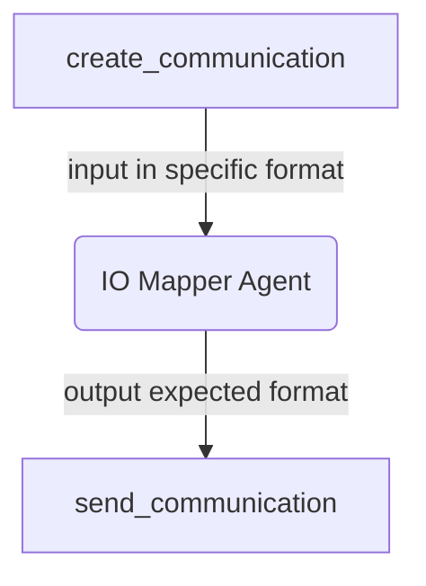

# IO-Mapper Agent

[](https://github.com/agntcy/acp-sdk/blob/main/CODE_OF_CONDUCT.md)

## About The Project

When connecting agents in an application, the output of one agent needs to be compatible with the input of the following agent. This compatibility needs to be guaranteed at three different levels:

1. transport level: the two agents need to use the same transport protocol.
2. format level: the two agents need to carry information using the same format (e.g. same JSON data structures)
3. semantic level: the two agents need to “talk about the same thing”.

Communication between agents is not possible if there are discrepancies between the agents at any of the layers [1-3].

Ensuring that agents are semantically compatible, i.e., the output of the one agent contains the information needed
by later agents, is an problem of composition or planning in the application. This project, the IO Mapper Agent,
addresses level 2 and 3 compatibility. It is a component, implemented as an agent, that can make use of an LLM
to transform the output of one agent to become compatible to the input of another agent. Note that this may mean
many different things, for example:

- JSON structure transcoding: A JSON dictionary needs to be remapped into another JSON dictionary
- Text summarisation: A text needs to be summarised or some information needs to be removed
- Text translation: A text needs to be translated from one language to another
- Text manipulation: Part of the information of one text needs to be reformulated into another text
- Any combination of the above

The IO mapper Agent can be fed the schema definitions of inputs and outputs as defined by the [Agent Connect Protocol](https://github.com/agntcy/acp-spec).

## Getting Started

To get a local copy up and running follow these simple steps.

### Prerequisites

### Installation

1. Clone the repository

   ```sh
   git clone https://github.com/agntcy/iomapper-agnt.git
   ```

## Usage

There are several different ways to leverage the IO Mapper functions in Python. There
is an [agentic interface](#use-agent-io-mapper) using models that can be invoked on
different AI platforms and a [imperative interface](#use-imperative--deterministic-io-mapper)
that does deterministic JSON remapping without using any AI models.

## Key features

The Agent IO Mapper uses an LLM/model to transform the inputs (typically output of the
first agent) to match the desired output (typically the input of a second agent). As such,
it additionally supports specifying the model prompts for the translation. The configuration
object provides a specification for the system and default user prompts:

This project supports specifying model interactions using [LangGraph](https://langchain-ai.github.io/langgraph/).

## How to use the Agent IO mapping

### LangGraph Example 1

### To use this agent in a LangGraph multi agent software:

#### Define an agent io mapper metadata

```python
metadata = IOMappingAgentMetadata(
    input_fields=["selected_users", "campaign_details.name"],
    output_fields=["stats.status"],
)

```

The above instruction directs the IO mapper agent to utilize the `selected_users` and `name` from the `campaign_details` field and map them to the `stats.status`. No further information is needed since the type information can be derived from the input data which is a pydantic model.

:information_source: Both input_fields and output_fields can also be sourced with a list composed of str and/or instances of FieldMetadata as the bellow example shows:

```python
metadata = IOMappingAgentMetadata(
    input_fields=[
        FieldMetadata(
            json_path="selected_users", description="A list of users to be targeted"
        ),
        FieldMetadata(
            json_path="campaign_details.name",
            description="The name that can be used by the campaign",
            examples=["Campaign A"]
        ),
    ],
    output_fields=["stats"],
)
```

<details>
<summary><h4>Expand to better understand the IOMappingAgentMetadata Interface</h4></summary>
## IOMappingAgentMetadata model Interface
<table>
    <tr>
        <th>Field</th>
        <th>Description</th>
        <th>Required</th>
        <th>Example</th>
    </tr>
    <tr>
        <td>input_fields</td>
        <td>an array of json paths and or instances of FieldMetadata </td>
        <td>:white_check_mark:</td>
<td>

`["state.fiedl1", "state.field2", FieldMetadata(json_path="state", description="this is a list of items")]`

</td>
    </tr>
    <tr>
        <td>output_fields</td>
        <td>an array of json paths and or instances of FieldMetadata </td>
        <td>:white_check_mark:</td>
<td>

`["state.output_fiedl1"]`

</td>
    </tr>
    <tr>
        <td>input_schema</td>
        <td>defines the schema of the input data</td>
        <td> :heavy_minus_sign: </td>
        <td>
            
```json
{ 
    "type": "object",
    "properties": {
        "title": {"type": "string"},
        "ingredients": {"type": "array", "items": {"type": "string"}},
        "instructions": {"type": "string"},
    },
    "required": ["title", "ingredients, instructions"],
}
```
<hr />
OR

```python
from pydantic import TypeAdapter
TypeAdapter(GraphState).json_schema()
```

</td>
    </tr>
    <tr>
        <td>output_schema</td>
        <td>defines the schema for the output data</td>
        <td>:heavy_minus_sign:</td>
        <td>same as input_schema</td>
    </tr>
</table>
</details>

### Define an Instance of the Agent

```python
mapping_agent = IOMappingAgent(metadata=metadata, llm=llm)
```

<details>
<summary>Expand for explanation of interface for IOMappingAgent model</summary>

<table>
    <tr>
        <th>Field</th>
        <th>Description</th>
        <th>Required</th>
        <th>Example</th>
    </tr>
    <tr>
        <td>metadata</td>
        <td>Instance of IOMappingAgentMetadata</td>
        <td>:white_check_mark:</td>
<td>
            
```python
IOMappingAgentMetadata(
    input_fields=["documents.0.page_content"],
    output_fields=["recipe"],
    input_schema=TypeAdapter(GraphState).json_schema(),
    output_schema={
        "type": "object",
        "properties": {
            "title": {"type": "string"},
            "ingredients": {"type": "array", "items": {"type": "string"}},
            "instructions": {"type": "string"},
        },
        "required": ["title", "ingredients, instructions"],
    },
)
```
 </td>
</tr>

<tr>
    <td>llm</td>
    <td>An instance of the large language model to be used</td>
    <td>:white_check_mark:</td>
<td>
    
```python
        AzureChatOpenAI(
            model=model_version,
            api_version=api_version,
            seed=42,
            temperature=0,
        )
```
</td>
</tr>
</table>
</details>

### Add the node to the LangGraph graph

```python
workflow.add_node(
    "io_mapping",
    mapping_agent.langgraph_node,
)
```

### Finally add the edge and you can run the your LangGraph graph

```python
workflow.add_edge("create_communication", "io_mapping")
workflow.add_edge("io_mapping", "send_communication")
```

Here is a flow chart of io mapper in a langgraph graph of the discussed application



#### LangGraph Example 2

This example involves a multi-agent software system designed to process a list of ingredients. It interacts with an agent specialized in recipe books to identify feasible recipes based on the provided ingredients. The information is then relayed to an IO mapper, which converts it into a format suitable for display to the user.

### Define an agent io mapper metadata

```python
metadata = IOMappingAgentMetadata(
    input_fields=["documents.0.page_content"],
    output_fields=["recipe"],
    input_schema=TypeAdapter(GraphState).json_schema(),
    output_schema={
        "type": "object",
        "properties": {
            "title": {"type": "string"},
            "ingredients": {"type": "array", "items": {"type": "string"}},
            "instructions": {"type": "string"},
        },
        "required": ["title", "ingredients, instructions"],
    },
)
```

### Define an Instance of the Agent

```python
mapping_agent = IOMappingAgent(metadata=metadata, llm=llm)
```

### Add the node to the LangGraph graph

```python
graph.add_node(
    "recipe_io_mapper",
    mapping_agent.langgraph_node,
)
```

### Finally add the edge and you can run the your LangGraph graph

```
graph.add_edge("recipe_expert", "recipe_io_mapper")
```

#### LlamaIndex

This project supports specifying model interations using [LangGraph](https://langchain-ai.github.io/langgraph/).

### LlamaIndex AgentWorkflow

## Use Imperative / Deterministic IO Mapper

The code snippet below illustrates a fully functional deterministic mapping that
transforms the output of one agent into input for a second agent. The code for the
agents is omitted.

```python
 # define schema for the origin agent
 input_schema = {"question": {"type": "string"}}

 # define schema to witch the input should be converted to
 output_schema = {
     "quiz": {
         "type": "object",
         "properties": {
             "prof_question": {"type": "string"},
             "due_date": {"type": "string"},
         },
     }
 }

 # the mapping object using jsonpath, note: the value of the mapping
 # can be either a jsonpath or a function
 mapping_object = {
     "prof_question": "$.question",
     "due_date": lambda _: datetime.now().strftime("%x"),
 }

 input = IOMapperInput(
     input=ArgumentsDescription(
         json_schema=Schema.model_validate(input_schema)
     ),
     output=ArgumentsDescription(
         json_schema=Schema.model_validate(output_schema)
     ),
     data={"question": output_prof},
 )
 # instantiate the mapper
 imperative_mapp = ImperativeIOMapper(
     field_mapping=mapping_object,
 )
 # get the mapping result and send to the other agent
 mapping_result = imperative_mapp.invoke(input=input)
```

### Use Examples

1. To run the examples we strongly recommend that a
   [virtual environment is created](https://packaging.python.org/en/latest/guides/installing-using-pip-and-virtual-environments/)
2. Install the requirements file
3. From within examples folder run:

```shell
make run_imperative_example
```

## Contributing

Contributions are what make the open source community such an amazing place to
learn, inspire, and create. Any contributions you make are **greatly
appreciated**. For detailed contributing guidelines, please see
[CONTRIBUTING.md](https://github.com/agntcy/acp-sdk/blob/main/docs/CONTRIBUTING.md)

## Copyright Notice and License

[Copyright Notice and License](https://github.com/agntcy/acp-sdk/blob/main/LICENSE)

Copyright (c) 2025 Cisco and/or its affiliates.

Licensed under the Apache License, Version 2.0 (the "License");
you may not use this file except in compliance with the License.
You may obtain a copy of the License at

       http://www.apache.org/licenses/LICENSE-2.0

Unless required by applicable law or agreed to in writing, software
distributed under the License is distributed on an "AS IS" BASIS,
WITHOUT WARRANTIES OR CONDITIONS OF ANY KIND, either express or implied.
See the License for the specific language governing permissions and
limitations under the License.
