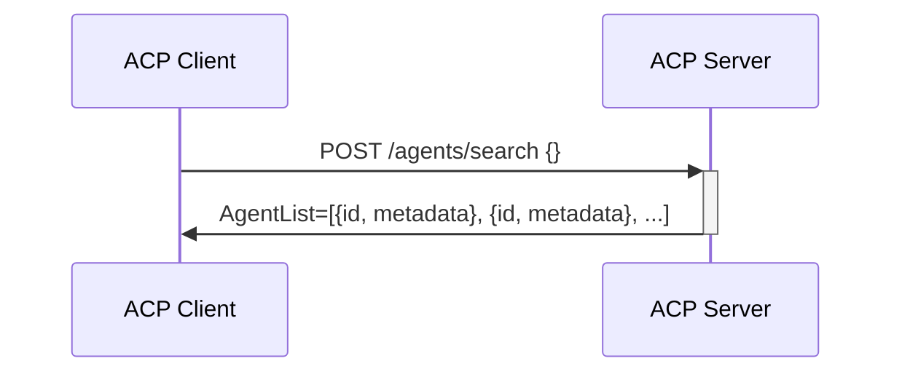
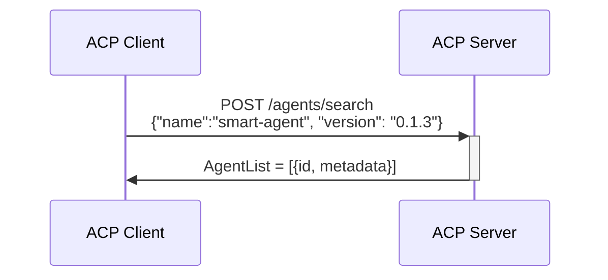
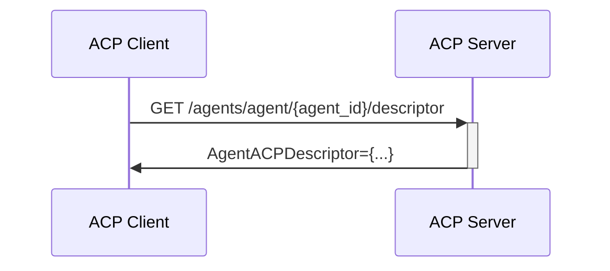
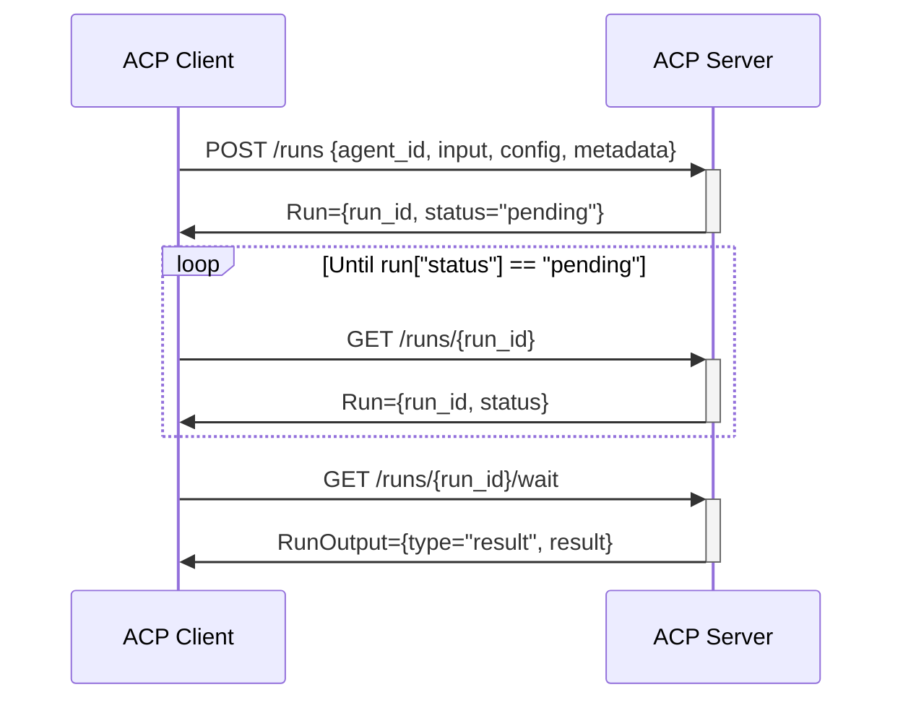
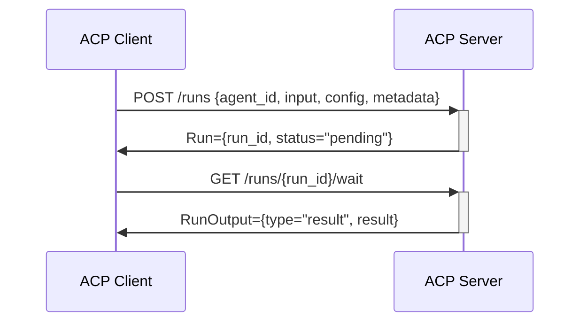
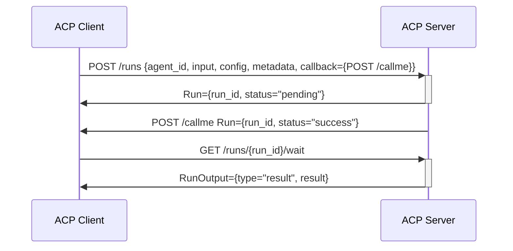
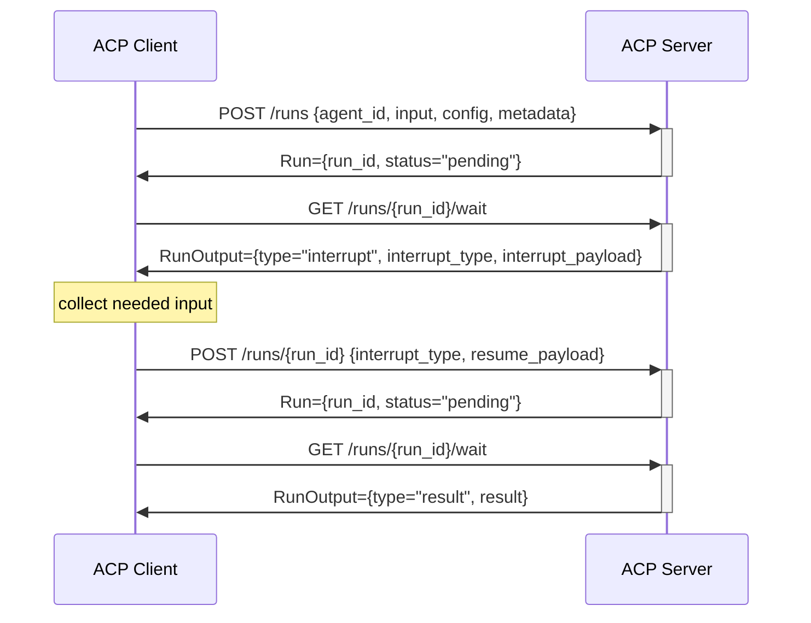
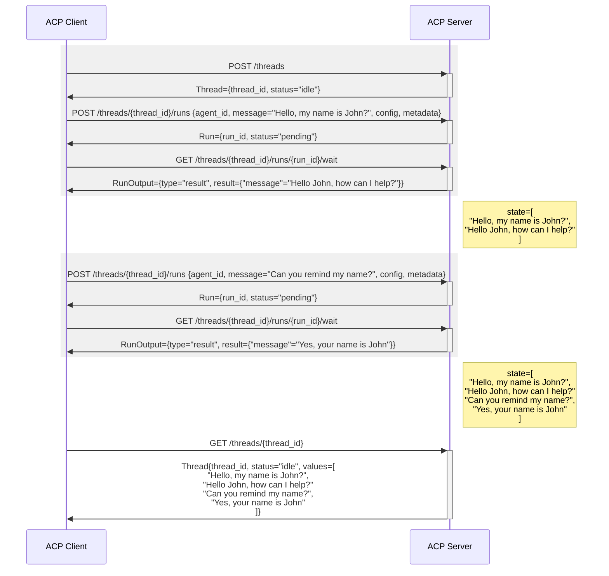
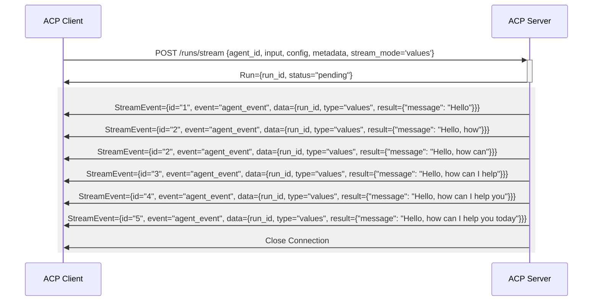

# Agent Connect Protocol

## Introduction

Existing Multi-Agent Systems (MAS) provide convenient ways to build Multi-Agent Applications (MAAs) that combine various agents and enable them to communicate with each other. Such communication occurs within the MAS using internal mechanisms and APIs.

Building the Internet of Agents (IoA) requires agents built by different parties, potentially for different MAS and potentially running in different locations to interact.

While interaction between co-located agents implemented through the same MAS is trivial, it is harder in case the agents are not natively compatible or in case they run in different locations.

We propose a solution where all agents are able to communicate over the network using a standard protocol to interoperate. We call it the **Agent Connect Protocol** (**ACP**).

This document describes the main requirements and design principles of the ACP.

The current specification of the ACP can be found at [https://spec.acp.agntcy.org/](https://spec.acp.agntcy.org/).

## Getting Started

See current ACP specification in [JSON Format](https://github.com/agntcy/acp-spec/blob/main/openapi.json) or browse its [OpenAPI visualization](https://spec.acp.agntcy.org/).

Learn how to use the API by looking at [API Usage Flows](#api-usage-flows)

Learn about Agent ACP Descriptor and its usage [here](#agent-acp-descriptor)

Explore tools for ACP and Agent ACP Descriptors in the [Agent Connect SDK Documentation](../syntactic/agntcy_acp_sdk.md)

## ACP Requirements

Agent Connect Protocol needs to formally specify the network interactions needed to address the following:

* **Authentication**: Define how caller authenticates with an agent and what its permissions are.
* **Configuration**: Define how to configure a remote agent.
* **Invocation**: Define how to invoke a remote agent providing input for its execution.
* **Output retrieval and interrupt Handling**: Define how to retrieve the result of an agent invocation. Different interaction modes should be supported:
    * Synchronous
    * Asynchronous
    * Streaming

    This should include interrupt handling. That is, how agents notify the caller about execution suspension to ask for additional input.
* **Capabilities and Schema definitions**: Retrieve details about the agent supported capabilities and the data structures definitions for configuration, input, and output.
* **Error definitions**: Receive error notifications with meaningful error codes and explanations.


### Authentication and Authorization
Agents invoked remotely need to authenticate the caller and make sure they have the proper authorization to perform the invocation.

Authorization mechanisms are outside the scope of the ACP specification.

ACP does not enforce a single authentication scheme to be used by all agents. Instead, it defines a list of allowed authentication schemes and lets agents declare which one is adopted.

For the reason above, ACP must define an endpoint that does not require authentication and returns the specific authentication scheme that is supported by the agent.

<a id="configuration"></a>
### Configuration

Agents may support configuration.

Configuration is meant to provide parameters needed by the agent to function and to flavor their behavior.

Configurations are typically valid for multiple invocations.

ACP needs to define an endpoint to provide agent configuration.

This endpoint must be distinct by the invocation endpoint, in this case it must return an identifier of the configured instance of the agent that can be used in multiple subsequent invocations.

Invocation endpoint should also provide an option to specify the configuration. In this case the configuration is valid only for the specific invocation.

Format of the configuration data structure is specified through a schema. For more information, see [Schema Definitions](#schemas).

Configuration endpoint may return an error. For more information, see [Error Definitions](#errors).

<a id="invocation"></a>
### Invocation

ACP must define an invocation endpoint that triggers the execution of an agent or resume a previously interrupted execution of an agent.

The invocation endpoint must accept the following parameters:

* **Input**

    An input provides specific information and contexts for the agent to operate. Format of the input data structure is specified through a schema. For more information, see [Schema Definitions](#schemas).

* **Optional configuration**

    When provided, this configuration is valid only for this invocation. Alternatively, the invocation endpoint must accept the identifier of a previously configured instance of an agent. For more information, see [Configuration](#configuration).

* **Optional callback**

    When provided, the output of the invocation is provided asynchronously through the provided callback. For more information, see [Output Retrieval and Interrupt Handling](#output).

* **Optional execution identifier**

    In this case, the agent is requested to resume a previously interrupted execution, identified by the execution identifier.

The invocation endpoint must return the following:

* The **output** of the execution, in case it is provided synchronously.
* An **execution identifier**, which is then used to receive asynchronous output and to resume an interrupted execution.

Invocation endpoint may return an error. For more information, see [Error Definitions](#errors).

<a id="output"></a>
### Output Retrieval

Once an agent is invoked, it can provide output as a result of its operations.

Output can be provided to the caller synchronously (as a response of the invocation endpoint) or asynchronously (through a callback provided as input of the invocation endpoint).

Output can be provided when the following conditions occur:
* The agent has terminated its execution and provides the final result of the execution.
* The agent has interrupted its execution because it needs additional input. For example approval or chat interaction.
* The agent is still running but it provides partial results, that is, streaming.

Output must carry information about which condition occurred.

Format of the output data structure is specified through a schema. For more information, see [Schema Definitions](#schemas).

<a id="schemas"></a>
### Capabilities and Schema Definitions

The ACP does not mandate the format of the data structures used to carry information to and from an agent but it allows agents to provide definitions of those formats through the ACP.
The ACP must define an endpoint that provides schema definitions for configuration, input, and output.

Different agents may implement different parts of the protocol. For example: an agent may support streaming, while another may only support full responses. An agent may support threads while another may not.

The ACP must define an endpoint that provides details about the specific capabilities that the agent supports.

Schemas, agent capabilities, and other essential information that describe an agent are also needed in what we call the [Agent Manifest](../manifest/manifest.md).

<a id="errors"></a>
### Error Definitions

Each of the operations offered by the ACP can produce an error.

Errors can be provided synchronously by each of the invoked endpoints or asynchronously when they occur during an execution that supports asynchronous output.

The ACP must define errors for the most common error conditions.

Each definition must include the following details:
* Error code.
* Description of the error condition.
* A flag that says if the error is transient or permanent.
* An optional schema definition of additional information that the error can be associated with.

The ACP also allows agents to provide definitions of errors specific for that agent. For this purpose, the ACP must define an endpoint that provides schema definitions for all agent specific errors that are not included in the ACP specification.


## API Usage Flows

### Agents Retrieval APIs

ACP offers an API to search for the agents served by the ACP server.
Once a client has an agent identifier `AgentID`, it can use it to either retrieve the agent descriptor or to control agent runs.

#### Retrieve all agents supported by the server
In this case, the client is doing a search of all agents in the server without specifying any search filter. Result is the list of all agents.



#### Retrieve an agent from its name and version
In this case, the client knows name and version of an agent (e.g. learnt from the record in the Agent Directory) and wants to retrieve its `id` to interact with the agent.



#### Retrieve agent descriptor from its identifier
In this case, the client knows the agent id and wants to retrieve its descriptor to learn about the capabilities supported and the data schemas to use.



### Runs
A run is a single execution of an agent.

#### Start a Run of an Agent and poll for completion
In this case, the client starts a background run of an agent, keeps polling the server until the run is complete, finally it retrieves the run output.


In the sequence above:
1. The client requests to start a run on a specific agent, providing its `agent_id`, and specifying:
    * Configuration: a run configuration is flavoring the behavior of this agent for this run.
    * Input: run input provides the data the agent will operate on.
    * Metadata: metadata is a free format object that can be used by the client to tag the run with arbitrary information.
1. The server returns a run object which includes the run identifier and a status, the status at the beginning will be `pending`.
1. The client retrieves the status of the run until completion.
1. The server returns the run object with the updated status.
1. The client request the output of the run with the `wait` endpoint, which returns immediately, since the run is done.
1. The server returns the final result of the run.

>
> Note that the format of the input and the configuration are not specified by ACP, but they are defined in the agent descriptor.
>

#### Start a Run of an Agent and block until completion
In this case, the client starts a background run of an agent and immediately tries to retrieve the run output blocking on this call until completion or timeout.



In the sequence above:
1. The client requests to start a run on a specific agent.
1. The server returns a run object.
1. The client request the output of the run with the `wait` endpoint. In this case the request and blocks until run status changes.
1. The server returns the final result of the run. Note that in case the timeout had expired before, the server would have returned no content.

#### Start a Run of an Agent with a callback
Agents can support callbacks, i.e. asynchronously call back the client upon run status change. The support for interrupts is signaled in the agent descriptor.

In this case, the client starts a background run of an agent and provide a callback to be called upon completion.


In the sequence above:
1. The client requests to start a run on a specific agent, providing an additional `callback`.
1. The server returns a run object.
1. Upon status change, the server calls the provided call back with the run object.
1. The client request the output of the run with the `wait` endpoint, which returns immediately, since the run is done.
1. The server return the final result of the run.

### Run Interrupt and Resume
Agent can support interrupts, i.e. the run execution can interrupt to request additional input to the client. The support for interrupts is signaled in the agent ACP descriptor.

When an interrupt occurs, the server provides the client with an interrupt payload, which specifies the interrupt type that has occurred and all the information associated with that interrupt, i.e. a request for additional input.

The client can collect the needed input for the specific interrupt and resume the run by providing the resume payload, i.e. the additional input requested by the interrupt.

>
> Note that the type of interrupts and the correspondent interrupt and resume payload are not specified by ACP, because they are agent dependent. They are instead specified in the agent ACP descriptor.
>

The interrupt is provided by the server when the client requests the output.

#### Start a run and resume it upon interruption

In this case, the client asks for the agent output and receives an interrupt instead of the final output. The client then resumes the run providing the needed input and finally when the run is completed, gets the result.


In the sequence above:
1. The client start the run.
1. The server returns the run object.
1. The client requests the output.
1. The server returns an interrupt, specifying interrupt type and the associated payload.
1. The client resumes the run providing the needed input in the resume payload.
1. the client requests the output.
1. The server returns the final result.

### Thread Runs
Agents can support thread run. Support for thread run is signaled in the agent ACP descriptor.

When an agent supports thread run, each run is associated to a thread, and at the end of the run a thread state is kept in the server.

Subsequent runs on the same thread use the previously created state, together with the run input provided.

The server offers ways to retrieve the current thread state, the history of the runs on a thread, and the evolution of the thread states over execution of runs.

Runs over the same thread can be executed on different agents, as long as the agents support the same thread state format.

```{eval-rst}
.. note:: Note that the format of the thread state is not specified by ACP, but it is (optionally) defined in the agent ACP descriptor. If specified, it can be retrieved by the client, if not it's not accessible to the client.
```

#### Start of multiple runs over the same thread
In this case the client starts a sequence of runs on the same thread accumulating a state in the server. In this specific example the input is a chat message, while the state kept in the server is the chat history.


In the sequence above:
1. The client requests to create a thread on the server
1. The server returns a thread object that contains a thread ID
1. The client starts the first run on the created thread and provides the first message of the chat.
1. The server returns the run object.
1. The client requests the run output.
1. The server returns the run output which is the next chat message from the agent and leaves a state with the current chat history.
1. The client starts a new run on the same thread providing the input for the run, i.e. the next message in the chat (assuming the existence of the chat history on the server).
1. The server starts the runs using the existing chat history and returns the run object.
1. The client requests the run output.
1. The server updates the thread state and returns the run output.
1. Finally, the client requests the thread state (this is an optional operation).
1. The server returns the current thread object which collects the whole chat history.

### Output Streaming
ACP supports output streaming. Agent can stream partial results of a Run to provide better response time and user experience.

ACP implements streaming using Server Sent Events specified here: https://html.spec.whatwg.org/multipage/server-sent-events.html.

In a nutshell, the client keeps the HTTP connection open and receives a stream of events from the server, where each event carries an update of the run result.

ACP supports 2 streaming modes:
1. **values** where each event contains a full instance of the agent output, which fully replace the previous update.
2. **custom** where the schema of the event is left unspecified by ACP, which it can be specified in the specific agent ACP descriptor under `spec.custom_streaming_update`

#### Start a Run and stream output until completion



In the sequence above:
1. The client requests to start a run on a specific agent specifying stream_mode = 'values' and waits immediately for the streaming.
1. The client requests the output streaming and keeps the connection open.
1. The server returns an event with message="Hello".
1. The server returns an event with updated message "Hello, how".
1. The server returns an event with updated message "Hello, how can".
1. The server returns an event with updated message "Hello, how can I help".
1. The server returns an event with updated message "Hello, how can I help you".
1. The server returns an event with updated message "Hello, how can I help you today".
1. The server closes the connection because the output is complete.

## Agent ACP descriptor

Agent ACP Descriptor is a descriptor that contains all the needed information to know how:
* [Identify an agent.](#agent-metadata)
* [Know its capabilities.](#agent-specs)
* Consume its capabilities.

The Agent ACP Descriptor can be obtained from the [Agent Directory](https://docs.agntcy.org/pages/dir.html) or can be obtained through an [ACP call](#retrieve-agent-descriptor-from-its-identifier).

### Agent descriptor sections and examples

We present the details of a sample agent ACP descriptor through the various descriptor sections.

```{eval-rst}
.. admonition:: Full sample Descriptor
    :collapsible: closed

    .. literalinclude:: sample_acp_descriptors/mailcomposer.json
        :language: JSON
```

#### Agent Metadata

Agent Metadata section contains all the information about agent identification and a description of what the agent does.
It contains unique name which together with a version constitutes the unique identifier of the agent. The uniqueness must be guaranteed within the server it is part of and more generally in the Agent Directory domain it belongs to.

```{eval-rst}
.. admonition:: Sample descriptor metadata section for the mailcomposer agent
    :collapsible: open

    .. code-block:: json
        :caption: Metadata for a mail composer agent named `org.agntcy.mailcomposer` version `0.0.1`.

        {
            "metadata": {
                "ref": {
                    "name": "org.agntcy.mailcomposer",
                    "version": "0.0.1",
                    "url": "https://github.com/agntcy/docs/blob/main/docs/pages/syntactic_sdk/sample_acp_descriptors/mailcomposer.json"
                },
                "description": "This agent is able to collect user intent through a chat interface and compose wonderful emails based on that."
            }
            ...
        }
```

#### Agent Specs

Agent Specs section includes ACP invocation capabilities and the schema definitions for ACP interactions.

The ACP capabilities that the agent support, e.g. `streaming`, `callbacks`, `interrupts` etc.

The schemas of all the objects that this agent supports for:
   * Agent Configuration.
   * Run Input.
   * Run Output.
   * Interrupt and Resume Payloads.
   * Thread State.

Note that these schemas are needed in the agent ACP descriptor, since they are agent specific and are not defined by ACP, i.e. ACP defines a generic JSON object for the data structures listed above.

```{eval-rst}
.. admonition:: Sample metadata specs section for the mailcomposer agent
    :collapsible: closed

    .. code-block:: json

        {
            ...
            "specs": {
            "capabilities": {
                "threads": true,
                "interrupts": true,
                "callbacks": true
            },
            "input": {
                "type": "object",
                "description": "Agent Input",
                "properties": {
                    "message": {
                        "type": "string",
                        "description": "Last message of the chat from the user"
                    }
                }
            },
            "thread_state": {
                "type": "object",
                "description": "The state of the agent",
                "properties": {
                "messages": {
                    "type": "array",
                    "description": "Full chat history",
                    "items": {
                        "type": "string",
                        "description": "A message in the chat"
                    }
                }
                }
            },
            "output": {
                "type": "object",
                "description": "Agent Input",
                "properties": {
                    "message": {
                        "type": "string",
                        "description": "Last message of the chat from the user"
                    }
                }
            },
            "config": {
                "type": "object",
                "description": "The configuration of the agent",
                "properties": {
                "style": {
                    "type": "string",
                    "enum": ["formal", "friendly"]
                }
                }
            },
            "interrupts": [
                {
                "interrupt_type": "mail_send_approval",
                "interrupt_payload": {
                    "type": "object",
                    "title": "Mail Approval Payload",
                    "description": "Description of the email",
                    "properties": {
                    "subject": {
                        "title": "Mail Subject",
                        "description": "Subject of the email that is about to be sent",
                        "type": "string"
                    },
                    "body": {
                        "title": "Mail Body",
                        "description": "Body of the email that is about to be sent",
                        "type": "string"
                    },
                    "recipients": {
                        "title": "Mail recipients",
                        "description": "List of recipients of the email",
                        "type": "array",
                        "items": {
                            "type": "string",
                            "format": "email"
                        }
                    }
                    },
                    "required": [
                        "subject",
                        "body",
                        "recipients"
                    ]
                },
                "resume_payload": {
                    "type": "object",
                    "title": "Email Approval Input",
                    "description": "User Approval for this email",
                    "properties": {
                    "reason": {
                        "title": "Approval Reason",
                        "description": "Reason to approve or decline",
                        "type": "string"
                    },
                    "approved": {
                        "title": "Approval Decision",
                        "description": "True if approved, False if declined",
                        "type": "boolean"
                    }
                    },
                    "required": [
                        "approved"
                    ]
                }
                }
            ]
            }
            ...
        }

    The agent supports threads, interrupts, and callback.

    It declares schemas for input, output, and config:
    * As input, it expects the next message of the chat from the user.
    * As output, it produces the next message of the chat from the agent.
    * As config it expects the style of the email to be written.

    It supports one kind of interrupt, which is used to ask user for approval before sending the email. It provides subject, body, and recipients of the email as interrupt payload and expects approval as input to resume.

    It supports a thread state which holds the chat history.
```
